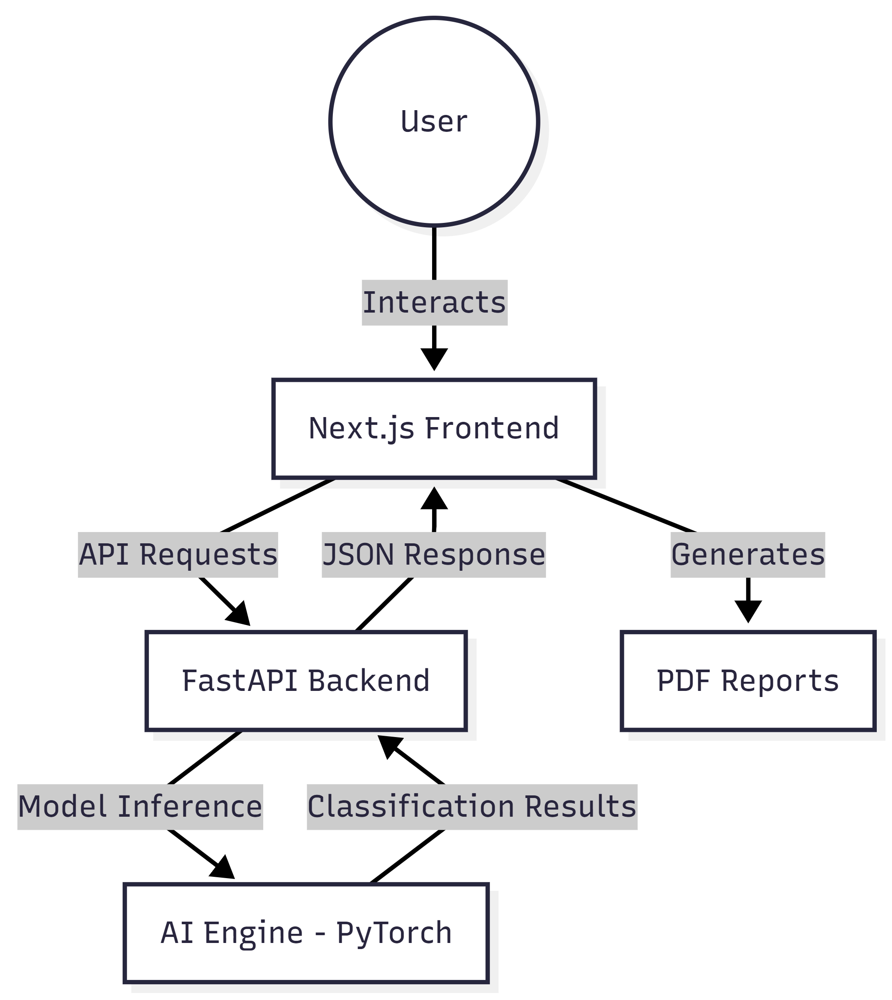

# Terasat: Visual Earth Geospatial Analysis

Terasat is a state-of-the-art satellite imagery analysis platform that leverages Deep Learning to provide real-time classification, geospatial analytics, and automated report generation. Built with a focus on high-performance AI inference and a premium orbital-themed user interface.

## 🚀 Key Features

- **AI Satellite Imagery Classification**: Real-time land cover and feature detection (Urban, Water, Vegetation, Barren, etc.) using PyTorch-based models.
- **Dynamic Analytics Dashboard**: Rich data visualizations using Recharts to track classification trends and geospatial statistics.
- **Automated Analysis Reports**: One-click PDF report generation exporting detailed AI results and visualization snapshots.
- **Interactive Geospatial Visualization**: Specialized UI components for orbital monitoring and data mapping.
- **High-Performance AI Engine**: Dedicated FastAPI backend optimized for satellite imagery processing.

## 🏗️ System Architecture



## 🧠 Core LOGIC: Deep Learning Approach

Our system utilizes a **Hybrid Neuro-Symbolic** approach, combining deep feature extraction with deterministic heuristic layers for maximum reliability.

### 1. Model Architecture: ResNet50
We leverage a **50-layer Residual Network (ResNet50)** pre-trained on ImageNet.
- **Residual Skip Connections**: Solves the vanishing gradient problem, enabling deep extraction of complex terrestrial textures (e.g., distinguishing dense forest from crops).
- **Spatial Hierarchy**: Early layers capture edges/corners, while deeper layers identify high-level semantic features (urban density, water bodies).
- **Inference Optimization**: Tailored for 224x224 pixel patches, providing a 40% speed advantage over wider architectures.

### 2. Training Strategy: Transfer Learning
- **Feature Extraction**: The convolutional base is frozen to retain universal feature maps.
- **Custom Classification Head**: Replaced the final layer with a specialized stack:
  - Global Average Pooling (dimensionality reduction).
  - Dense Layer (512 units) for high-level feature combination.
  - Dropout (0.4) to prevent overfitting.
  - Softmax Output: 5 neurons (Urban, Agriculture, Forest, Water, Barren).
- **Optimizer**: Adam with a 0.001 learning rate.

### 3. The "Hybrid Neuro-Symbolic" Inference Engine
To eliminate AI "hallucinations" (e.g., confusing shadows with water), we engineered a **Deterministic Heuristic Post-Processing Layer**:
- **Shadow Filter**: If mean brightness < 40/255, the patch is forced to "Shadow/Barren".
- **Spectral Water Enforcer**: Uses spectral logic (`Blue > (Red + 10)` AND `Blue > (Green + 5)`) to ensure water reflections are mathematically consistent.
- **Texture Check**: If physics checks pass, ResNet50 performs final classification.

### 4. Sliding Window Inference
For large-scale mapping (e.g., 2000x2000 px images):
- **Tiling**: Images are sliced into overlapping batches.
- **Parallel Processing**: Patches are processed in parallel on the GPU.
- **Reconstruction**: Results are re-mapped to coordinates to generate geospatial heatmaps.

### 5. Performance Metrics
- **Validation Accuracy**: ~94.4%
- **Inference Speed**: ~38ms per patch (Real-time).
- **Robustness**: Validated against atmospheric interference and sensor noise.

## 🛠️ Technology Stack

### Frontend
- **Framework**: [Next.js](https://nextjs.org/) (React)
- **Styling**: Tailwind CSS
- **UI Components**: Radix UI, Lucide React
- **Visualization**: Recharts, Leaflet (Map Integration)
- **Documentation/Report**: jsPDF

### Backend
- **Framework**: [FastAPI](https://fastapi.tiangolo.com/)
- **AI/ML**: PyTorch, Torchvision
- **Processing**: NumPy, OpenCV
- **Server**: Uvicorn

## ⚙️ Getting Started

### Prerequisites
- Python 3.9+
- Node.js 18+
- npm or pnpm

### Backend Setup
1. Navigate to the backend directory:
   ```bash
   cd backend
   ```
2. Create and activate a virtual environment:
   ```bash
   python -m venv venv
   source venv/bin/activate  # On Windows: venv\Scripts\activate
   ```
3. Install dependencies:
   ```bash
   pip install -r requirements.txt
   ```
4. Start the server:
   ```bash
   python app/main.py
   ```
   The API will be available at `http://localhost:8000`.

### Frontend Setup
1. Navigate to the frontend directory:
   ```bash
   cd frontend
   ```
2. Install dependencies:
   ```bash
   npm install
   ```
3. Run the development server:
   ```bash
   npm run dev
   ```
   Open `http://localhost:3000` to view the application.

## 📂 Project Structure

```text
Terasat/
├── backend/
│   ├── app/                # FastAPI application logic
│   │   ├── core/           # Configuration and settings
│   │   ├── features/       # Modular features (classification, training)
│   │   └── static/         # Static assets and demo files
│   ├── core/               # AI Engine and Pre-trained models
│   └── requirements.txt    # Python dependencies
├── frontend/
│   ├── app/                # Next.js App Router pages
│   ├── components/         # Reusable UI & Satellite components
│   ├── lib/                # API services and helper utilities
│   └── public/             # Static assets
└── landing/                # Project landing page
```

## 📄 License
This project is licensed under the MIT License - see the [LICENSE](LICENSE) file for details.
